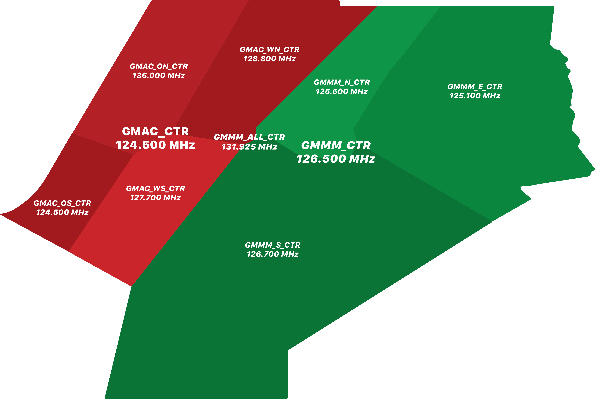

# Casablanca Radar (GMMM)

### Coverage

When controlling GMAC_CTR, you will cover the whole oceanic sector of Morocco. In contrast, GMMM_CTR covers the land sector, and GMMM_ALL_CTR encompasses both the land and oceanic sectors, covering the whole FIR.

### GMMM FIR Overview

### Sector Splits

GMAC_CTR is divided into four sectors on the network, each with its own callsign and frequency.

<table>
  <thead>
    <tr>
      <th>Sector Callsign</th>
      <th>Frequency</th>
      <th>Callsign</th>
      <th>Vertical Boundary</th>
    </tr>
  </thead>
  <tbody>
    <tr>
      <td class="foo"><em>GMAC_ON_CTR</em></td>
      <td><em class="foo">136.000 MHz</em></td>
      <td><em class="foo">Agadir Radar</em></td>
      <td><em class="foo">SFC - FL 195 FL 195 - FL 460 FL 460 - UNL</em></td>
    </tr>
    <tr>
      <td class="foo"><em>GMAC_OS_CTR</em></td>
      <td><em class="foo">124.500 MHz</em></td>
      <td><em class="foo">Agadir Radar</em></td>
      <td><em class="foo">SFC - FL 195 FL 195 - FL 460 FL 460 - UNL</em></td>
    </tr>
    <tr>
      <td class="foo"><em>GMAC_WN_CTR</em></td>
      <td><em class="foo">128.800 MHz</em></td>
      <td><em class="foo">Agadir Radar</em></td>
      <td><em class="foo">SFC - FL 195 FL 195 - FL 460 FL 460 - UNL</em></td>
    </tr>
    <tr>
      <td class="foo"><em>GMAC_WS_CTR</em></td>
      <td><em class="foo">127.700 MHz</em></td>
      <td><em class="foo">Agadir Radar</em></td>
      <td><em class="foo">SFC - FL 195 FL 195 - FL 460 FL 460 - UNL</em></td>
    </tr>
  </tbody>
</table>

### Handoffs

Handoffs between different FIRs can be viewed in the Letter of Agreement (LoA) section of the site. If a specific FIR LoA is not available, you should perform aircraft handoffs normally within 5-10 NM of the FIR boundary.