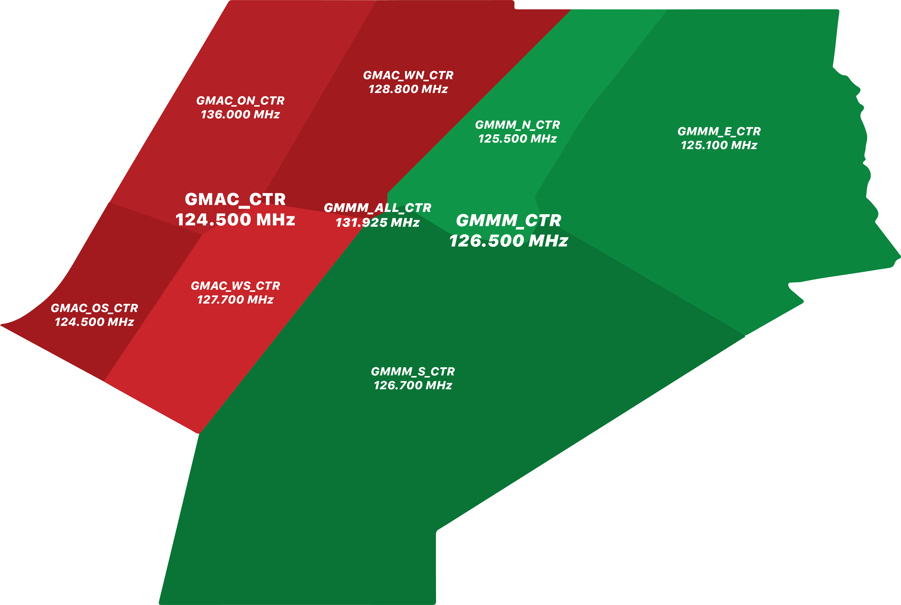

# Casablanca Radar (GMMM)

### Coverage

When controlling GMMM_CTR, you have jurisdiction over all the land airports in Morocco. In contrast, GMAC_CTR covers the oceanic sector, and GMMM_ALL_CTR encompasses both the land and oceanic sectors, covering the whole FIR.

### GMMM FIR Overview

### Sector Splits

GMMM_CTR is divided into three sectors on the network, each with its own callsign and frequency.

<table>
  <thead>
    <tr>
      <th>Sector Callsign</th>
      <th>Frequency</th>
      <th>Callsign</th>
      <th>Vertical Boundary</th>
    </tr>
  </thead>
  <tbody>
    <tr>
      <td class="foo"><em>GMMM_N_CTR</em></td>
      <td><em class="foo">125.500 MHz</em></td>
      <td><em class="foo">Casablanca Radar</em></td>
      <td><em class="foo">SFC - FL 195 FL 195 - FL 460 FL 460 - UNL</em></td>
    </tr>
    <tr>
      <td class="foo"><em>GMMM_E_CTR</em></td>
      <td><em class="foo">125.100 MHz</em></td>
      <td><em class="foo">Casablanca Radar</em></td>
      <td><em class="foo">SFC - FL 195 FL 195 - FL 460 FL 460 - UNL</em></td>
    </tr>
    <tr>
      <td class="foo"><em>GMMM_S_CTR</em></td>
      <td><em class="foo">126.700 MHz</em></td>
      <td><em class="foo">Casablanca Radar</em></td>
      <td><em class="foo">SFC - FL 195 FL 195 - FL 460 FL 460 - UNL</em></td>
    </tr>
  </tbody>
</table>

### Jurisdiction

As stated in the coverage section, if there is no controller assigned to a specific airport below your position, you will assume responsibility for that airport. You have authority over all the airports in a top-down manner unless there is a controller online at a lower position. In that case, the controller below will hand off the aircraft when neccessary.