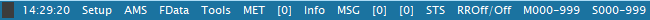
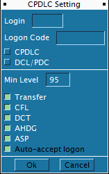
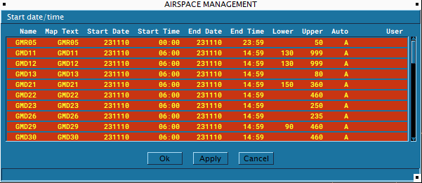
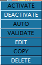

# TopSky

### What is TopSky?

TopSky is utilised in the Maghreb region to manage controlled airspace, with the exception of Algeria, which does not use EuroScope. TopSky plays a crucial role in controlling tower and upwards, mainly crucial for APP & ACC.

This guide will cover only the most important functions of TopSky.

### TopSky Bar

This TopSky Menu is found at the top of your radar screen, just below the euroscope bar. It will display the time in UTC time and has multiple menu items which may look confusing at first but this guide should help you understand how all of these work and make your controlling a little easier.

#### Settings / Setup

Starting with Setup, this guide will only explain what you need to know in these sections. You should not need to configure anything else as it's been configured for Maghreb already.

##### CPDLC

Navigating to Setup -> CPDLC Setting will show you CPDLC menu.

Depending on the position you connect to, this menu will already be configured and should be open. In that case, all you need to do is put your HOPPIE code and click OK. This  will establish the connection for CPDLC, allowing pilots in your airspace to utilise CPDLC.

#### AMS (Airspace Management)

AMS is what controls the data we provide to TopSky in order to display certain danger zones / restricted zones at certain dates & times or if it's a permanent restricted zone.

When right clicking on the title of a zone, a menu will appear which will allow you to some actions to that zone. You should not need to touch this for any particular reason but incase of needing to disable/activate a zone, you can do it by simply clicking deactivate/activate.

#### FData (Flight Data)